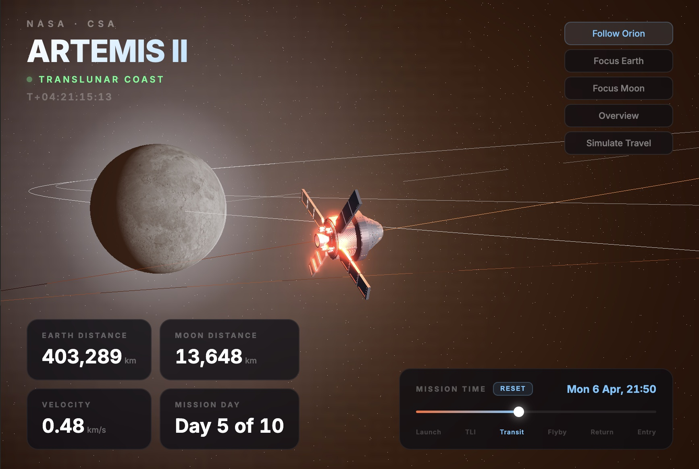

# Artemis II — Live 3D Mission Tracker

A real-time, interactive 3D visualization of NASA's **Artemis II** mission built entirely in a single HTML file using [Three.js](https://threejs.org/). Track the Orion spacecraft as it travels to the Moon and back using real trajectory data from NASA's Jet Propulsion Laboratory.

**[Live Demo](https://javilop.github.io/artemis-ii-tracker/)**



## Features

- **Real-time tracking** — Orion's position is interpolated from real JPL Horizons ephemeris data, synced to the actual mission timeline (launch: April 1, 2026 @ 22:35 UTC)
- **Realistic 3D Orion model** — Detailed STL mesh of the Orion spacecraft with service module and solar arrays, correctly oriented along its flight path
- **Accurate Earth rotation** — Uses GMST (Greenwich Mean Sidereal Time) computed from the J2000.0 epoch for correct continent orientation and day/night cycle
- **Sun position from JPL data** — Sun direction derived from real geocentric EME2000 coordinates, synced with timeline
- **Moon with real texture** — Realistic lunar surface texture with accurate orbital position from JPL Horizons (body 301)
- **Multiple camera modes:**
  - **Follow Orion** — Camera tracks the spacecraft with orbit controls
  - **Focus Earth** — Close-up of Earth with atmosphere
  - **Focus Moon** — Tracks the Moon through the mission
  - **Overview** — Bird's-eye view of the full trajectory
- **Timeline scrubbing** — Drag the slider to explore any point in the 10-day mission
- **Simulate Travel** — Speed up time at 1,000x to 50,000x to watch the full mission unfold
- **Live telemetry** — Earth distance, Moon distance, velocity, and mission day displayed in real-time
- **Mission phases** — Visual timeline markers for Launch, TLI, Transit, Flyby, Return, and Entry
- **MET counter** — Mission Elapsed Time displayed as T+DD:HH:MM:SS
- **Responsive design** — Works on desktop and mobile
- **Bloom post-processing** — Subtle glow effects for the Sun, engine, and navigation beacon

## Technical Details

### Trajectory Data

All trajectory data comes from NASA's **JPL Horizons** system:

- **Spacecraft:** Orion (ID -1024), geocentric EME2000 (J2000 equatorial) frame
- **Moon:** Body 301, same frame and time steps
- **Resolution:** 2-hour intervals from TLI through end of mission
- **Coordinate mapping:** EME2000 `[X, Y, Z]` to Three.js `[X, Z, -Y]` (right-handed Y-up)

### Earth Orientation

Earth's rotation uses the GMST formula:

```
GMST(deg) = 280.46061837 + 360.98564736629 * d
```

where `d` is Julian days since J2000.0 (January 1, 2000, 12:00 TT).

### Stack

- **Three.js** (r170) — 3D rendering, OrbitControls, EffectComposer, UnrealBloomPass, STLLoader
- **Single HTML file** — Zero build step, zero dependencies beyond Three.js CDN
- **GitHub Pages** — Deployed via GitHub Actions

## Credits

- **Trajectory data:** [NASA/JPL Horizons](https://ssd.jpl.nasa.gov/horizons/)
- **Orion 3D model:** [DeltaX on Cults3D](https://cults3d.com/) — CC BY 4.0
- **Earth texture:** [three-globe](https://github.com/vasturiano/three-globe)
- **Moon texture:** [three-globe](https://github.com/vasturiano/three-globe) / [Three.js examples](https://github.com/mrdoob/three.js)
- **Built with:** [Three.js](https://threejs.org/)

## License

[MIT](LICENSE)
